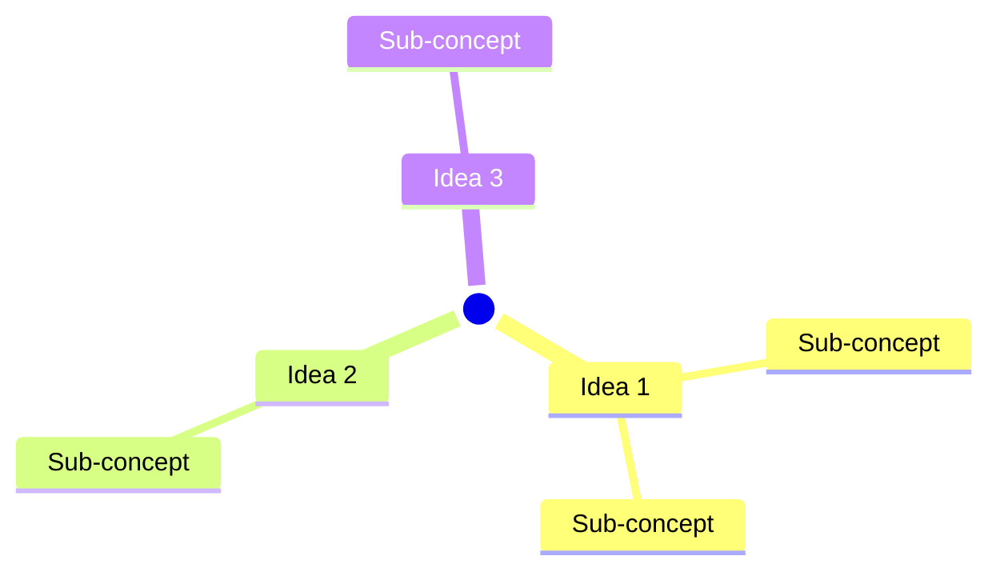
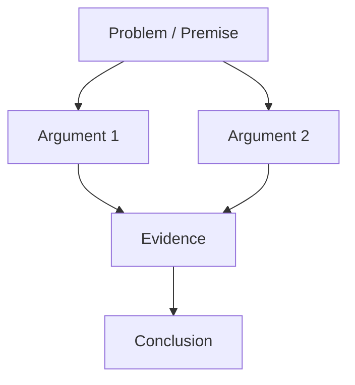
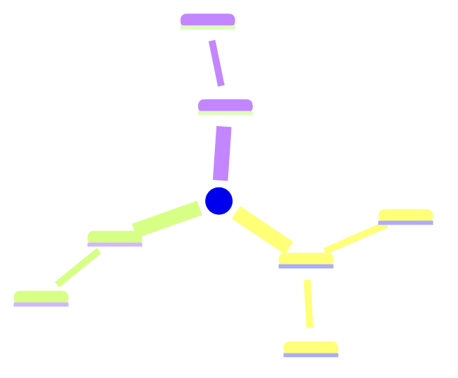
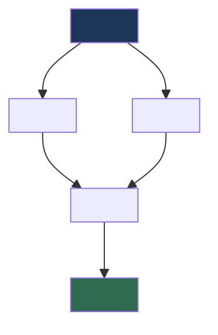

# Article Digest

This skill turns any article on the internet into a complete, richly-formatted Obsidian note — a permanent digest you can search, link, and build on. The Python script handles fetching and cleaning the raw content; your job is the intelligence: understanding the article deeply and writing a digest that actually *sticks*.

**Core principle**: Never write a single word of the note before completing the full discovery conversation. Every preference matters.

---

## Language Rules — Non-Negotiable

These rules apply **regardless of which language the user chose**. They are not preferences — they are hard constraints:

### English Terms Are Never Translated

When writing in any Arabic mode (عامي مصري، فصيح، or Bilingual), **English technical terms, named concepts, proper nouns, and domain-specific vocabulary must appear in English exactly as they are.** Never invent an Arabic equivalent for a term that has an established English name.

This means: `algorithm`, `bias`, `cognitive load`, `framework`, `peer review`, `abstract`, `methodology`, `hypothesis`, `ROI`, `GDP`, `AI`, `startup`, `burnout`, `peer-reviewed`, `placebo`, `meta-analysis` — and any other established term in any field — stay in English. Always.

✅ **Correct**: `الـ cognitive load بتاع الدماغ بيزيد لما...`
✅ **Correct**: `الـ study اللي اتنشر في Nature`
✅ **Correct**: `نتيجة الـ peer review أثبتت إن...`
❌ **Wrong**: `العبء المعرفي على الدماغ بيزيد لما...` ← (translated `cognitive load`)
❌ **Wrong**: `الدراسة اللي اتنشرت في Nature` ← (translated `study`)

### RTL Flow Rule

When the chosen language is Arabic (عامي مصري، فصيح، or Bilingual): **any heading or sentence whose visible text starts with an English word must be prefixed with `الـ`** so the line begins in Arabic/RTL. This applies to headings, paragraphs, list items, blockquotes, table cells — any line of running text.

Skip this rule for:
- Code blocks (``` ```, `inline code`)
- URLs
- YAML frontmatter
- Direct quotes preserved verbatim
- Table formatting pipes

Examples:
- ✅ `الـ Abstract بتاع المقال بيقول...`
- ✅ `الـ Anders Hejlsberg عمل demo لـ TypeScript 7`
- ✅ `1. الـ TypeScript 7 rewrite من JS لـ Go`
- ❌ `Abstract المقال بيقول...`
- ❌ `Anders Hejlsberg عمل demo لـ TypeScript 7`

---

## Step 0 — Interactive Discovery (One Question at a Time)

This is the most important phase. Ask questions **one at a time**, wait for the user to answer each one before moving to the next. Do not batch or rush. Each question should feel like a natural conversation — not a form.

The goal is to understand what this person actually wants from this article before you write anything. Their answers will shape everything: the language, the depth, the structure, the save location, the focus.

---

### Question 1 — The Article URL

If the user hasn't already provided a URL in their initial message, ask:

```
تمام! هبدأ معاك خطوة خطوة.

أول حاجة — ابعتلي رابط المقال اللي عايز أقراه وألخصه ليك.
```

If they already sent the URL with their first message, skip to Question 2 and acknowledge it naturally:

```
تمام، شايف الرابط. هبدأ أجيبه دلوقتي.

[proceed to fetch while asking Question 2]
```

Store the URL. **Do not proceed with fetching yet** — wait until you have the URL confirmed, then begin fetching while asking Question 2 (they can run in parallel).

---

### Question 2 — Language Preference

```
عايز التلخيص بأي لغة؟

[1] عربي مصري عامي — شرح بالعامي زي ما بتتكلم
[2] عربي فصيح      — كتابة رسمية واضحة
[3] English         — full English digest
[4] Bilingual       — عناوين إنجليزي + شرح بالعامي المصري
```

Store as `language`. Wait for answer before continuing.

---

### Question 3 — Summary Depth

```
عايز التلخيص يكون بأي عمق؟

[A] Quick Read    — فكرة رئيسية + أهم ٧ نقاط (مثالي لو وقتك ضيق)
[B] Deep Digest   — تحليل كامل: أفكار، حجج، أمثلة، اقتباسات
[C] Critical Lens — تحليل نقدي: إيه اللي المقال بيقوله وإيه اللي مش بيقوله
[D] Study Mode    — ملاحظات دراسية مع مصطلحات وأسئلة مراجعة
```

Store as `depth`. Wait for answer before continuing.

---

### Question 4 — Save Location

```
فين عايز أحفظ الملف؟ ابعتلي الـ path كامل.

مثال: /home/user/Obsidian/Vault/Articles

لو مش متأكد من المسار، قولي وهنفكر فيه مع بعض.
```

Store as `save_path`. Confirm the path exists (or offer to create it). Wait for answer before continuing.

---

### Question 5 — Article Focus (Optional but Powerful)

```
سؤال أخير — في حاجة معينة عايز أركز عليها في المقال؟

مثلاً:
- "ركز على الأدلة والإحصاءات"
- "عايز تطبيقات عملية"
- "ركز على النقد والرأي المعارض"
- "مش محتاج — اعمل تلخيص شامل"

لو مش عارف، قول 'شامل' وأنا هختار الأنسب.
```

Store as `focus`. This is the last question — after the answer, confirm all preferences and proceed.

---

### Pre-Execution Confirmation

Before doing any writing, show a brief summary of what you're about to do:

```
تمام! فاهم كل حاجة. هعمل الآتي:

📄 المقال: <title if already fetched, or "جاري الجلب...">
🌐 الموقع: <site_name>
🗣️ اللغة: <language choice>
📊 العمق: <depth choice>
🎯 التركيز: <focus>
💾 الحفظ: <save_path>

هبدأ؟ (أو قولي لو عايز تغير حاجة)
```

Wait for a "yes" or confirmation. If they request a change, adjust and confirm again. **Never write the file without explicit go-ahead.**

---

## Step 1 — Fetch the Article

Run the fetch script with the confirmed URL:

```bash
python3 "$(dirname "$0")/scripts/fetch_article.py" --url "<CONFIRMED_URL>"
```

The script outputs a JSON object to stdout:

```json
{
  "url":          "https://example.com/article",
  "title":        "Article Title",
  "author":       "Author Name or null",
  "date":         "YYYY-MM-DD or null",
  "site_name":    "example.com",
  "description":  "Short meta description or null",
  "word_count":   2400,
  "read_minutes": 10,
  "content":      "Full clean article text...",
  "media": {
    "images": [
      {"src": "https://example.com/diagram.jpg",  "alt": "Chart showing X vs Y"},
      {"src": "https://example.com/photo.jpg",    "alt": "Author speaking at event"}
    ],
    "videos": [
      {"src": "https://youtube.com/embed/abc123", "platform": "youtube"},
      {"src": "https://player.vimeo.com/video/456", "platform": "vimeo"}
    ],
    "links": [
      {"href": "https://example.com/source1", "text": "Original research paper"},
      {"href": "https://example.com/tool",    "text": "Recommended tool"}
    ]
  },
  "status":       "ok"
}
```

**Parse all fields.** If `status` is not `"ok"`, tell the user what went wrong and suggest alternatives (e.g., the site may block automated access — ask them to paste the text manually). Do not continue if content is missing.

If `content` is under 200 words, warn the user: the page may not have loaded fully or may require JavaScript. Offer to proceed anyway or stop.

---

## Step 2 — Internal Content Analysis

Before writing anything, perform this analysis internally (do not show to user unless asked):

- **Core Thesis**: What is the single central argument, claim, or story?
- **Structure Pattern**: How is the article organized? (argument → evidence, problem → solution, narrative, listicle, Q&A, opinion, research summary, etc.)
- **Key Arguments**: The 3–7 main points or ideas the author makes.
- **Evidence Quality**: Does the author use data, anecdotes, expert quotes, personal experience? How credible?
- **Notable Quotes**: 1–3 quotable sentences worth preserving verbatim.
- **Tone & Bias**: Is this objective, opinion-led, academic, journalistic, promotional? Any clear slant?
- **Target Audience**: Who is this written for?
- **What's Missing**: What does the article NOT address that would be relevant?
- **Topic Tags**: 2–5 Obsidian tags (e.g., `psychology`, `technology`, `productivity`, `politics`).
- **Notable Media**: Which images, diagrams, infographics, or charts meaningfully support the article's argument? Which embedded videos (YouTube, Vimeo) are central to the content? Which external links are worth preserving as references?

Use this analysis to shape the note according to the chosen `depth` and `focus`. The `focus` answer from Step 0 is your editorial compass — let it guide which sections get more detail.

---

## Step 3 — Write the Obsidian Note

### Filename Convention

Generate from the article title:
- Lowercase everything
- Replace spaces and special characters with hyphens
- Remove all characters except letters, numbers, hyphens
- Max 65 characters
- Prefix with today's date: `YYYY-MM-DD-`
- Append `.md`

Example: `"The Hidden Costs of Remote Work"` → `2026-07-28-the-hidden-costs-of-remote-work.md`

---

### YAML Frontmatter

Every note must begin with this complete frontmatter. All fields are **Dataview-compatible** — property names use underscores, dates use ISO format, lists use proper YAML arrays:

```yaml
---
title: "<Article Title>"
source: "<Article URL>"
author: "<Author Name or unknown>"
published: "<YYYY-MM-DD or unknown>"
site: "<site_name>"
date_digested: <today YYYY-MM-DD>
read_time: <N>
topic: "<primary topic — single word or short phrase>"
digest_language: "<language choice>"
digest_depth: "<depth choice: Quick Read | Deep Digest | Critical Lens | Study Mode>"
rating: null
tags:
  - article-digest
  - <topic_tag>
  - <topic_tag>
status: digested
---
```

> **`rating`** is left `null` intentionally — the user fills it in (1–5) after reading. **`read_time`** is a plain integer (minutes) so Dataview can do math on it. **`date_digested`** has no quotes so Dataview treats it as a date type.

---

### Universal Formatting Rules

Apply across **all styles and all languages**. Use the full Obsidian + Markdown feature set — never leave a feature unused if it genuinely improves clarity:

| Element | Obsidian Syntax | When to Use |
|---------|-----------------|-------------|
| Document title | `# H1` — one per note | Article title |
| Major sections | `## H2` | Top-level sections |
| Sub-sections | `### H3` | Details within a section |
| Section breaks | `---` | Between every major section |
| Key terms | `**bold**` | First mention of important concepts |
| Secondary emphasis | `*italic*` | Titles of referenced works, foreign terms |
| Critical insight | `**bold**` | The single most important sentence per section |
| Author quotes | `> blockquote` | Direct quotations from the article |
| Inline code | `` `code` `` | Technical terms, formulas, exact values |
| Action items | `- [ ] checkbox` | Anything the reader can act on |
| Internal links | `[[wikilink]]` | Concepts that may link to other vault notes |
| Aliased links | `[[Note Name\|display text]]` | When the display text should differ from the note name |
| Block reference | `^block-id` at end of paragraph | Mark a paragraph for citation from other notes |
| Footnote | `[^1]` inline, `[^1]: text` at end | Source citations, clarifications |
| Embedded note | `![[Note Name]]` | Embed a related vault note inline |
| Math | `$$formula$$` | Only for articles with mathematical content |
| Mermaid diagram | ` ```mermaid ``` ` | Concept maps, argument flow, timelines |
| Inline image | `` or `` | Embed an article image in context near the relevant paragraph |
| Image gallery | `` — one per line | List key images in the `## Media` section |
| Video link | `[▶ YouTube: Title](url)` or `[🎬 Video Title](url)` | Link to embedded YouTube / Vimeo videos from the article |
| External link | `[text](url)` | Include notable links inline or in the `## Media` / `## Source` sections |

**Callout blocks** — use Obsidian native syntax with **foldable** variants where appropriate:

```markdown
> [!IMPORTANT]
> The core thesis or most critical claim.

> [!NOTE]
> Background context, definitions, or clarifying information.

> [!TIP]
> A practical application or actionable insight from the article.

> [!WARNING]
> A caution, counterargument, or limitation the author raises.

> [!QUOTE]
> A verbatim quote worth preserving.

> [!QUESTION]
> An open question the article raises but doesn't fully answer.

> [!ABSTRACT]- Summary (click to expand)
> Use this foldable variant for lengthy summaries in Study Mode.

> [!INFO]- Context
> Use foldable callouts for supplementary background that would interrupt flow.
```

**Mermaid concept map** — generate this for Deep Digest and Study Mode styles to visualize the article's idea structure:



Or use a flowchart for articles with a causal/argument structure:



Choose the diagram type that best fits the article's logical structure. If neither fits, omit the diagram — never force it.

---

### Media Embedding Rules

After writing the main sections but before `## Connections`, add a `## Media` section **if the `media` object from Step 1 contains any images, videos, or links.** Follow these rules:

| Media Type | Obsidian Syntax | Where to Place |
|------------|-----------------|----------------|
| Key image (diagram, chart, photo) | `` | **Inline** — embed it directly after the paragraph that discusses it, plus include in `## Media` |
| Supplementary image | `` | `## Media` section only |
| YouTube / Vimeo video | `[▶ Title of Video](video_src)` | `## Media` section as a bullet point |
| HTML5 video | `[🎬 Video: description](video_src)` | `## Media` section as a bullet point |
| Notable external link | `[link text](href)` | `## Media` section, or inline where cited |

**Selection criteria for `## Media`:**
- Only include images that carry informational value (charts, diagrams, infographics, relevant photos). Skip decorative, ad, or stock images.
- Include videos if they are embedded in the article as part of its content (not sidebar recommendations).
- Include links that are genuine references, sources, or recommended reading — not navigation or social-sharing links.
- If media is empty or irrelevant, **omit the `## Media` section entirely** — never force it.

**Inline image placement** (when a specific diagram or chart deserves to appear next to the text that explains it):

```markdown
### 1. Idea Name
Explanation of the idea that references a specific chart or diagram...


*Figure: caption describing what the chart shows.*
```

---

### Style A — Quick Read (موجز سريع)

Best for: fast consumption, deciding whether to read the full article.

```markdown
# <Article Title>

> [!IMPORTANT]
> **الفكرة الجوهرية**: <One sentence — the single core message of this article.>

---

## About This Article
**كتبه**: <Author> — **نُشر في**: <Site> — **تاريخ النشر**: <Date> — **وقت القراءة**: <N> دقيقة

---

## Key Points
- **<Point 1>**: <brief explanation>
- **<Point 2>**: <brief explanation>
- **<Point 3>**: <brief explanation>
- **<Point 4>**: <brief explanation>
- **<Point 5>**: <brief explanation>
- **<Point 6>**: <brief explanation>
- **<Point 7>**: <brief explanation>

---

## Bottom Line
==<The single most important sentence to take away from this article.>==

---

## Media *(optional — skip if empty)*


- [▶ <Video Title>](<video_src>)
- [<Link Text>](<link_href>)

---

## Connections
- Related to: [[<vault note that connects to this article's topic>]]
- Contradicts / supports: [[<another note if applicable>]]

---

## Source
- [Read Full Article](<URL>) — <Site Name> — <Date>
```

---

### Style B — Deep Digest (تحليل عميق)

Best for: comprehensive understanding, building permanent reference notes.

```markdown
# <Article Title>

> [!IMPORTANT]
> **Core Thesis**: <The central argument or claim the article makes.>

---

## About This Article
**كتبه**: <Author> — **نُشر في**: <Site> — **تاريخ النشر**: <Date> — **وقت القراءة**: <N> دقيقة

<2–3 sentences: What is this article? Why does it exist? What question does it set out to answer?>

---

## Concept Map



---

## Main Ideas

### 1. <Idea Name>
<Explanation of the idea, with context, evidence the author uses, and why it matters.> ^idea-1

> [!QUOTE]
> "<Direct quote from the article that captures this idea best>"

### 2. <Idea Name>
<Explanation...> ^idea-2

> [!TIP]
> <Practical implication of this idea.>

### 3. <Idea Name>
<Explanation...> ^idea-3

*(continue for all major ideas — usually 3–6)*

---

## Key Concepts & Terms

| Concept | What It Means |
|---------|---------------|
| [[<Term 1>]] | <Simple definition> |
| [[<Term 2>]] | <Simple definition> |

---

## Notable Quotes

> [!QUOTE]
> "<Most impactful quote from the article>"
> — <Author>[^1]

> [!QUOTE]
> "<Second quote if available>"

---

## What the Article Doesn't Address
<Briefly note any significant gaps, missing perspectives, or unanswered questions.>

> [!QUESTION]
> <The most important open question this article raises.>

---

## Media *(optional — skip if empty)*


*Figure: <brief caption for the image above>*

- [▶ <Video Title>](<video_src>)
- [<Link Text>](<link_href>)

---

## Connections
- Related to: [[<vault note on the same topic>]]
- Contradicts: [[<a note with an opposing view, if any>]]
- See also: [[<a relevant book note, course note, or daily log>]]

---

## My Notes & Reflections
> **أفكاري أنا:**
> *(اكتب هنا ردود فعلك وأفكارك بعد ما تقرأ المقال)*

---

## Source
- [Read Full Article](<URL>) — <Site Name> — <Author> — <Date>

[^1]: Quoted from the original article at <URL>
```

---

### Style C — Critical Lens (تحليل نقدي)

Best for: opinion pieces, research claims, journalism — understanding not just *what* is said but *how* and *why*.

```markdown
# <Article Title>

> [!IMPORTANT]
> **Core Claim**: <What does this article want you to believe or do?>

---

## About This Article
**كتبه**: <Author> — **نُشر في**: <Site> — **النوع**: <Opinion / Research / Journalism / Essay>

---

## Argument Flow



---

## What the Article Argues
<Neutral summary of the article's main argument and structure — 2–3 paragraphs.>

---

## Strengths
- **<Strength 1>**: <Why this point is well-made or well-evidenced>
- **<Strength 2>**: <...>

---

## Weaknesses & Gaps
- **<Weakness 1>**: <What's missing, oversimplified, or poorly supported>
- **<Weakness 2>**: <...>

> [!WARNING]
> <The most significant limitation or bias in this article's argument.>

---

## Tone & Framing
<What is the author's tone? (Alarmist / Optimistic / Neutral / Persuasive?) What assumptions does the framing make? Who is the intended audience and how does that shape the argument?>

---

## Counterarguments Not Addressed
<What would a skeptical reader say? What evidence or perspectives would challenge the article's conclusions?>

---

## Media *(optional — skip if empty)*


- [▶ <Video Title>](<video_src>)
- [<Link Text>](<link_href>)

---

## Connections
- Supports / challenges: [[<related vault note>]]
- Compare with: [[<a note with a different perspective on this topic>]]

---

## Verdict
==<Your one-sentence assessment: Is this article convincing? Worth reading? Partially flawed but useful?>=

---

## Source
- [Read Full Article](<URL>) — <Site Name> — <Author> — <Date>
```

---

### Style D — Study Mode (ملاحظات دراسية)

Best for: academic papers, research summaries, technical articles, educational content.

```markdown
# <Article Title>

---

## The Big Picture
<What is this about? Why is it important to study? What will I know by the end?>

---

## Concept Map


---

## Article Outline
1. <Section A>
2. <Section B>
3. <Section C>

---

## Detailed Notes

### 1. <Section A>
<Detailed notes in the chosen language...> ^section-a

> [!NOTE]
> **Definition — <Term>**: <Simple, clear definition.>

==<Most important sentence from this section.>==

### 2. <Section B>
<Notes...> ^section-b

### 3. <Section C>
<Notes...> ^section-c

---

## Glossary

| Term | Meaning | First seen |
|------|---------|------------|
| [[<Term 1>]] | <Definition> | [[#Section A]] |
| [[<Term 2>]] | <Definition> | [[#Section B]] |

---

## Key Statistics & Data
*(if applicable)*
- <Stat or data point from the article>
- <Stat or data point>

---

## Media *(optional — skip if empty)*

Key visuals and references from the article:


- [▶ <Video Title>](<video_src>)
- <External link: [text](href)>

---

## Self-Test Questions

1. <Question about Section A>?
2. <Question about Section B>?
3. <Question about Section C>?

---

> [!ABSTRACT]- Answers — click to expand
> **1.** <Answer to Q1>
>
> **2.** <Answer to Q2>
>
> **3.** <Answer to Q3>

---

## Connections
- Part of topic: [[<broad topic MOC or index note>]]
- Related reading: [[<another article or book note>]]
- Applied in: [[<a project or daily note where this is relevant>]]

---

## Source
- [Read Full Article](<URL>) — <Site Name> — <Author> — <Date>
```

---

## Step 4 — Save the Note

Create the directory if it doesn't exist and write the file:

```bash
mkdir -p "<save_path>"
```

Write the note content to `<save_path>/<filename>.md`.

Confirm success to the user:

```
تم الحفظ!

الملف:  <filename>.md
المسار: <full path>
حجمه:   <word_count> كلمة تقريباً
الملخص: <one natural sentence describing what the note contains>

تقدر تفتحه في Obsidian وتضيف ملاحظاتك الشخصية في قسم "My Notes & Reflections".
```

---

## Step 5 — Post-Save Offer

After confirming the save, offer one follow-up naturally:

```
في حاجة تانية عايز أعملها بالمقال ده؟

مثلاً:
- أضيف الملف للـ Daily Note بتاعتك
- أعمل mind map للأفكار الرئيسية
- أشرحلك مصطلح معين من المقال بالتفصيل
- لا شكراً، كفاية كده
```

If they want something, do it. If not, end the session gracefully.

---

## Error Handling

| Situation | What to Say |
|-----------|-------------|
| URL is blocked / JS-required | "الموقع ده بيمنع الجلب التلقائي. ممكن تنسخلي النص بنفسك وأشتغل عليه؟" |
| Content too short (< 200 words) | "الصفحة دي محتواها قصير جداً — ممكن تكون محتاجة login أو JavaScript. عايز تكمل بردو؟" |
| No title found | Use site_name + date as title fallback |
| Save path doesn't exist | Offer to create it with `mkdir -p` |
| Network error | "في مشكلة في الاتصال. تأكد من الرابط وجرب تاني." |

---

## Tooling Notes

- **Primary extractor**: `trafilatura` — best-in-class for article extraction from any site, no API key needed. Install: `pip install trafilatura`
- **Fallback**: `newspaper4k` — handles many news sites well. Install: `pip install newspaper4k`  
- **Last resort**: `requests` + `BeautifulSoup4` — basic HTML parsing. Install: `pip install requests beautifulsoup4`
- **Auto-install**: The script will try to install `trafilatura` automatically if missing.
- **Paywalled sites**: Most paywall sites (NYT, Bloomberg, etc.) cannot be fetched automatically. Suggest the user use a browser extension like "12ft Ladder" or paste the text manually.
- **Arabic sites**: Fully supported. Trafilatura handles RTL content and Arabic character sets correctly.
- **Caching**: No caching — articles are always fetched fresh to ensure the latest version.
