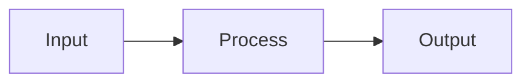

# File Templates

Copy these structures exactly (fill in the placeholders). All files use Obsidian-flavored Markdown: YAML frontmatter, `[[wikilinks]]`, callouts, tags, task lists, block references, and Mermaid diagrams where they genuinely help. No emojis anywhere.

---

## <topic-slug>-roadmap.md

```markdown
---
topic: <الاسم بالعربي> (<English Name>)
created: <YYYY-MM-DD>
type: roadmap
tags: [study, <topic-slug>]
aliases: [<English Name>, <optional other alias>]
---

# رود ماب: <الاسم بالعربي> (<English Name>)

> [!note] نظرة عامة
> نظرة عامة سريعة على الموضوع وليه يستاهل تتعلمه (2-3 جمل).

---

## المستوى الأول: مبتدئ (Beginner)
- [ ] [[01-<topic-slug>-<lesson-slug>|<اسم الدرس بالعربي/إنجليزي>]]
- [ ] [[02-<topic-slug>-<lesson-slug>|...]]
- [ ] **مشروع المستوى (Project):** [[NN-<topic-slug>-beginner-project-exercise|اسم المشروع]]

---

## المستوى الثاني: متوسط (Intermediate)
- [ ] [[0N-<topic-slug>-<lesson-slug>|...]]
- [ ] **مشروع المستوى (Project):** [[NN-<topic-slug>-intermediate-project-exercise|اسم المشروع]]

---

## المستوى الثالث: متقدم (Advanced)
- [ ] [[0N-<topic-slug>-<lesson-slug>|...]]
- [ ] **مشروع المستوى (Project):** [[NN-<topic-slug>-advanced-project-exercise|اسم المشروع]]

---

## التقدم
شوف [[<topic-slug>-progress]] عشان تعرف وصلت فين بالظبط.
```

Tick the checkbox (`- [x]`) when a lesson is completed — this mirrors `<topic-slug>-progress.md` visually inside Obsidian's own list/tag panes.

---

## lessons/NN-<topic-slug>-<lesson-slug>.md

```markdown
---
lesson: NN
topic: <الاسم بالعربي> (<English Name>)
level: beginner   # allowed values: beginner, intermediate, advanced
status: current    # allowed values: current, completed
tags: [<topic-slug>, lesson, beginner]   # third tag matches the level field above
aliases: [<optional alternate term, e.g. "Promises" for an async/await lesson>]
roadmap: "[[<topic-slug>-roadmap]]"
exercise: "[[NN-<topic-slug>-<lesson-slug>-exercise]]"
---

# الدرس NN: <عنوان الدرس بالعربي والإنجليزي لو المصطلح إنجليزي، زي "الدرس 3: الـ Array Methods">

> [!tip] ليه ده مهم؟
> جملة أو اتنين عن الفايدة العملية الحقيقية للمفهوم ده في الشغل، قبل ما ندخل في التفاصيل.

---

<شرح المفهوم — عربي مصري ممزوج بمصطلحات إنجليزية تقنية، أمثلة مناسبة ثقافياً. الكود دايماً إنجليزي بالكامل (تعليقات وأسامي متغيرات) حتى لو الشرح حواليه عربي.>

---

## مثال

```js
// English-only comments, always
function example() {
  return true;
}
```

> [!tip] لاحظ
> استخدم callout زي ده لو فيه نقطة مهمة أو غلطة شائعة تستاهل تتفرد عن باقي الشرح. لا تكرره أكتر من مرة أو اتنين في نفس الدرس.

---

<!-- استخدم Mermaid بس لو فيه ضرورة حقيقية (مفهوم مستحيل يتشرح كويس بدونه، زي flow متعدد الخطوات أو state machine) — مش افتراضي، أغلب الدروس معندهاش لازمة له -->


---

## نقطة مرجعية (اختياري)
مفهوم أساسي لازم يتربط منه لاحقاً. ^key-concept

---

## خلاصة الدرس (Recap)
- نقطة 1
- نقطة 2
- نقطة 3

---

> [!info] المراجع (References)
> - [اسم المصدر](الرابط) — وصف قصير ليه فيه
> - [اسم المصدر التاني](الرابط)

---

جاهز تحل التمرين؟ [[NN-<topic-slug>-<lesson-slug>-exercise|التمرين هنا]]
```

Use `^key-concept` block references only for the specific line/definition that a later lesson or a spaced-repetition review might need to point back to precisely (link to it via `[[NN-<topic-slug>-<lesson-slug>#^key-concept]]`). Don't add block IDs to every paragraph.

---

## exercises/NN-<topic-slug>-<lesson-slug>-exercise.md

```markdown
---
lesson: "[[NN-<topic-slug>-<lesson-slug>]]"
status: pending   # allowed values: pending, passed, retrying
attempts: 0
tags: [<topic-slug>, exercise]
---

# تمرين الدرس NN

<وصف المهمة المطلوبة بوضوح — لازم تطبيق فعلي للمفهوم، مش سؤال نظري بسيط>

---

## المطلوب
- [ ] جزء 1 من المهمة
- [ ] جزء 2 من المهمة (لو التمرين متعدد الأجزاء)

---

## إجابتك (Your Answer)

<!-- اكتب إجابتك هنا -->


---

## ملاحظات (Notes)
> [!question] هينت (يظهر بس لو المستخدم اتعثر)
> (hints/misconceptions logged here get appended after attempts, not before)

---

## الحل المرجعي (Answer Key)

> [!success]- اضغط هنا لو عايز تشوف الحل بعد ما تحل
> <الحل الكامل والصحيح للتمرين، بالكود كامل لو تمرين كود — دايماً إنجليزي زي أي كود تاني>
```

The `[!success]-` callout (note the trailing `-`) renders **collapsed/closed by default** in Obsidian — the solution exists in the file for reference, but isn't visible until the learner deliberately expands it themselves. This is different from revealing the solution in chat, which remains forbidden. Fill in the real, correct, complete solution here when you create the exercise file — don't leave it as a placeholder.

---

## <topic-slug>-progress.md

```markdown
---
topic: <الاسم بالعربي> (<English Name>)
type: progress
updated: <YYYY-MM-DD>
tags: [<topic-slug>, progress]
---

# التقدم في <الاسم بالعربي> (<English Name>)

**الدرس الحالي:** [[NN-<topic-slug>-<lesson-slug>|NN - اسم الدرس]]
**آخر تحديث:** <YYYY-MM-DD>

---

## الدروس المكتملة
| # | الدرس | تاريخ الإنجاز | محاولات التمرين | الثقة (1-5) |
|---|-------|----------------|-------------------|----------------|
| 01 | [[01-<topic-slug>-<lesson-slug>]] | YYYY-MM-DD | 1 | 4 |

---

## جدول المراجعة (Spaced Repetition)
| الدرس | آخر مراجعة | تاريخ المراجعة الجاية | الفترة الحالية | ملاحظة |
|-------|-------------|--------------------------|------------------|----------|
| [[01-<topic-slug>-<lesson-slug>]] | YYYY-MM-DD | YYYY-MM-DD | 3 days | - |

Interval progression on success: 1d -> 3d -> 7d -> 14d -> 30d
On failed recall: reset to 1d.
If confidence logged was 1-2 for a lesson, mark "يحتاج مراجعة إضافية" in the ملاحظة column and pull its next review date earlier than the normal interval would suggest — even if the exercise itself was passed correctly.

---

## سجل نقاط الضعف (Misconceptions Log)
| التاريخ | الدرس | الالتباس |
|---------|--------|-----------|
| YYYY-MM-DD | [[01-<topic-slug>-<lesson-slug>]] | وصف قصير للمفهوم اللي اتلخبط فيه |
```

---

## <topic-slug>-glossary.md

```markdown
---
topic: <الاسم بالعربي> (<English Name>)
type: glossary
updated: <YYYY-MM-DD>
tags: [<topic-slug>, glossary]
---

# قاموس مصطلحات <الاسم بالعربي> (<English Name>)

> [!note]
> كل مصطلح إنجليزي اتشرح لحد دلوقتي، مع تعريف مختصر بالعربي. المصطلح نفسه يفضل إنجليزي دايماً — الشرح بس بالعربي.

---

## <حرف التصنيف، مثلاً A>

**`array`** — [[NN-<topic-slug>-<lesson-slug>|جه في الدرس ده]]
تعريف مختصر بالعربي للمصطلح.

---

## <حرف تصنيف تاني>

**`closure`** — [[NN-<topic-slug>-<lesson-slug>|جه في الدرس ده]]
تعريف مختصر بالعربي للمصطلح.
```

Group entries alphabetically by the English term's first letter (simple `##` sub-headers per letter, as shown) so the file stays easy to scan as it grows. Each entry links back to the lesson where the term was first introduced via wikilink.

---

## Obsidian syntax cheat sheet (for quick reference while writing files)

| Feature | Syntax |
|---|---|
| Wikilink | `[[file]]` or `[[file\|display text]]` |
| Link to heading | `[[file#Heading]]` |
| Link to block | `[[file#^block-id]]` |
| Block ID | add `^block-id` at the end of the line |
| Callout | `> [!note]` / `> [!tip]` / `> [!warning]` / `> [!question]` |
| Tag | `#tagname` (inline) or `tags: [a, b]` (frontmatter) |
| Task list | `- [ ]` (open), `- [x]` (done) |
| Footnote | `text[^1]` ... `[^1]: the note` |
| Mermaid diagram | code fence with ```` ```mermaid ```` |
| Frontmatter alias | `aliases: [alt name 1, alt name 2]` |
| Code fence language | use the real one: ` ```js `/` ```python `/etc. for code, ` ```bash ` for terminal commands, ` ```text ` for plain output/logs |

Reminder: wikilink values placed **inside YAML frontmatter** must be quoted (`field: "[[file]]"`), otherwise `[[` is parsed as a YAML flow sequence and breaks the file. Wikilinks in the Markdown body (outside frontmatter) do not need quotes.
