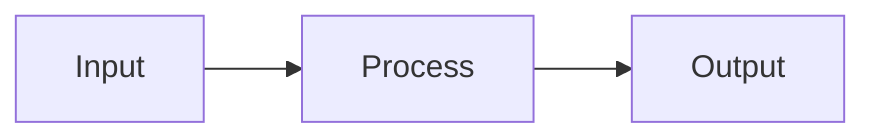

# File Templates

Copy these structures exactly (fill in the placeholders). All files use Obsidian-flavored Markdown: YAML frontmatter, `[[wikilinks]]`, callouts, tags, task lists, block references, and Mermaid diagrams where they genuinely help. No emojis anywhere.

---

## roadmap.md

```markdown
---
topic: <الاسم بالعربي> (<English Name>)
created: <YYYY-MM-DD>
type: roadmap
tags: [study, <topic-slug>]
aliases: [<English Name>, <optional other alias>]
---

# رود ماب: <الاسم بالعربي> (<English Name>)

> [!note] نظرة عامة
> نظرة عامة سريعة على الموضوع وليه يستاهل تتعلمه (2-3 جمل).

---

## المستوى الأول: مبتدئ (Beginner)
- [ ] [[01-<slug>|<اسم الدرس بالعربي/إنجليزي>]]
- [ ] [[02-<slug>|...]]

---

## المستوى الثاني: متوسط (Intermediate)
- [ ] [[0N-<slug>|...]]

---

## المستوى الثالث: متقدم (Advanced)
- [ ] [[0N-<slug>|...]]

---

## Progress
See [[progress]] for current status.
```

Tick the checkbox (`- [x]`) when a lesson is completed — this mirrors `progress.md` visually inside Obsidian's own list/tag panes.

---

## lessons/NN-slug.md

```markdown
---
lesson: NN
topic: <الاسم بالعربي> (<English Name>)
level: beginner   # allowed values: beginner, intermediate, advanced
status: current    # allowed values: current, completed
tags: [<topic-slug>, lesson, beginner]   # third tag matches the level field above
aliases: [<optional alternate term, e.g. "Promises" for an async/await lesson>]
roadmap: "[[roadmap]]"
exercise: "[[NN-slug-exercise]]"
---

# الدرس NN: <عنوان الدرس بالعربي والإنجليزي لو المصطلح إنجليزي، زي "الدرس 3: الـ Array Methods">

<شرح المفهوم — عربي مصري ممزوج بمصطلحات إنجليزية تقنية، أمثلة مناسبة ثقافياً. الكود دايماً إنجليزي بالكامل (تعليقات وأسامي متغيرات) حتى لو الشرح حواليه عربي.>

---

## مثال

```js
// English-only comments, always
function example() {
  return true;
}
```

> [!tip] لاحظ
> استخدم callout زي ده لو فيه نقطة مهمة أو غلطة شائعة تستاهل تتفرد عن باقي الشرح. لا تكرره أكتر من مرة أو اتنين في نفس الدرس.

---

<!-- استخدم Mermaid بس لو المفهوم فعلاً هيكلي/تدفقي (flow-based)، مش في كل درس -->


---

## نقطة مرجعية (اختياري)
مفهوم أساسي لازم يتربط منه لاحقاً. ^key-concept

---

## خلاصة الدرس (Recap)
- نقطة 1
- نقطة 2
- نقطة 3

---

جاهز تحل التمرين؟ [[NN-slug-exercise|التمرين هنا]]
```

Use `^key-concept` block references only for the specific line/definition that a later lesson or a spaced-repetition review might need to point back to precisely (link to it via `[[NN-slug#^key-concept]]`). Don't add block IDs to every paragraph.

---

## exercises/NN-slug-exercise.md

```markdown
---
lesson: "[[NN-slug]]"
status: pending   # allowed values: pending, passed, retrying
attempts: 0
tags: [<topic-slug>, exercise]
---

# تمرين الدرس NN

<وصف المهمة المطلوبة بوضوح — لازم تطبيق فعلي للمفهوم، مش سؤال نظري بسيط>

---

## المطلوب
- [ ] جزء 1 من المهمة
- [ ] جزء 2 من المهمة (لو التمرين متعدد الأجزاء)

---

## Notes
> [!question] هينت (يظهر بس لو المستخدم اتعثر)
> (hints/misconceptions logged here get appended after attempts, not before)
```

---

## progress.md

```markdown
---
topic: <الاسم بالعربي> (<English Name>)
type: progress
updated: <YYYY-MM-DD>
tags: [<topic-slug>, progress]
---

# التقدم في <الاسم بالعربي> (<English Name>)

**الدرس الحالي:** [[NN-slug|NN - اسم الدرس]]
**آخر تحديث:** <YYYY-MM-DD>

---

## الدروس المكتملة
| # | الدرس | تاريخ الإنجاز | محاولات التمرين |
|---|-------|----------------|-------------------|
| 01 | [[01-slug]] | YYYY-MM-DD | 1 |

---

## جدول المراجعة (Spaced Repetition)
| الدرس | آخر مراجعة | تاريخ المراجعة الجاية | الفترة الحالية |
|-------|-------------|--------------------------|------------------|
| [[01-slug]] | YYYY-MM-DD | YYYY-MM-DD | 3 days |

Interval progression on success: 1d -> 3d -> 7d -> 14d -> 30d
On failed recall: reset to 1d.

---

## سجل نقاط الضعف (Misconceptions Log)
| التاريخ | الدرس | الالتباس |
|---------|--------|-----------|
| YYYY-MM-DD | [[01-slug]] | وصف قصير للمفهوم اللي اتلخبط فيه |
```

---

## Obsidian syntax cheat sheet (for quick reference while writing files)

| Feature | Syntax |
|---|---|
| Wikilink | `[[file]]` or `[[file\|display text]]` |
| Link to heading | `[[file#Heading]]` |
| Link to block | `[[file#^block-id]]` |
| Block ID | add `^block-id` at the end of the line |
| Callout | `> [!note]` / `> [!tip]` / `> [!warning]` / `> [!question]` |
| Tag | `#tagname` (inline) or `tags: [a, b]` (frontmatter) |
| Task list | `- [ ]` (open), `- [x]` (done) |
| Footnote | `text[^1]` ... `[^1]: the note` |
| Mermaid diagram | code fence with ```` ```mermaid ```` |
| Frontmatter alias | `aliases: [alt name 1, alt name 2]` |

Reminder: wikilink values placed **inside YAML frontmatter** must be quoted (`field: "[[file]]"`), otherwise `[[` is parsed as a YAML flow sequence and breaks the file. Wikilinks in the Markdown body (outside frontmatter) do not need quotes.
